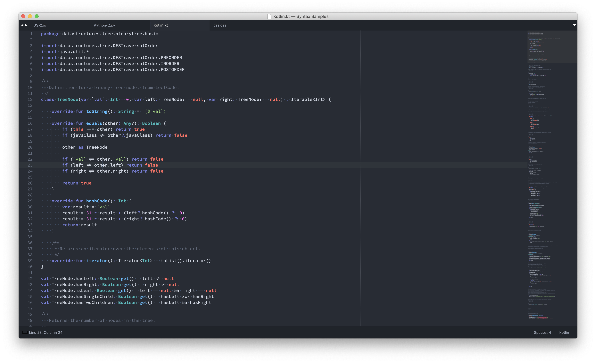
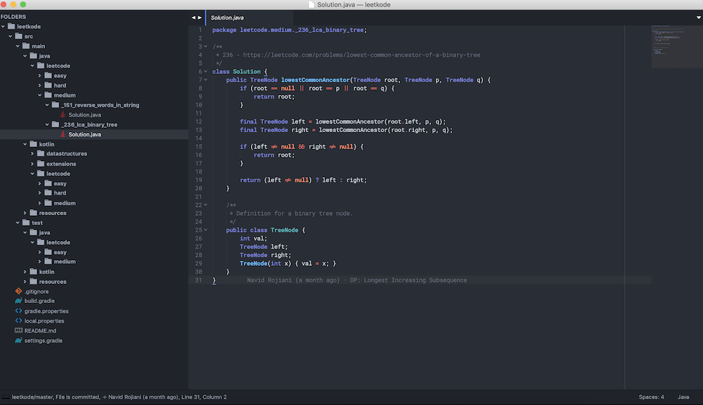

Ziggy Stardust Color Theme
==========================

## Screenshots

Java (IntelliJ/AndroidStudio):

Kotlin (IntelliJ/AndroidStudio):



Python (PyCharm):
TODO

WebStorm:
TODO

## Installation  

### JetBrains IDEs  
Copy the *.icls file to the `colors/` subdirectory of where your Preferences are stored:  

See [this link](https://intellij-support.jetbrains.com/hc/en-us/articles/206544519-Directories-used-by-the-IDE-to-store-settings-caches-plugins-and-logs) to find out the location based on the OS & JetBrains product.  

For macOS, this is located at:  
`~/Library/Preferences/{PRODUCT}{VERSION}/colors/`  
e.g.:  
`~/Library/Preferences/IntelliJIdea2019.2/colors/` or `~/Library/Preferences/IdeaIC2018.2/colors/`

The Themes work best with [Material Theme UI](http://www.material-theme.com/).
This color scheme goes well with the _Atom One Dark_ UI Theme Setting.
To switch to _Atom One Dark_ (after installing Material Theme UI, & restarting):

Open Preferences => Appearance & Behavior => Material Theme
and change _Selected Theme_ to Atom One Dark.

### Sublime Text ###
Copy `ZiggyStardust.tmTheme` to `~/Library/Application\ Support/Sublime\ Text\ 3/Packages/User`



### Atom ###
Copy or symlink `Atom/ziggy-stardust-syntax`:
```shell
$ ln -s Atom/ziggy-stardust-syntax ~/.atom/packages
```

### Visual Studio Code ###
Copy or symlink `VisualStudioCode/ziggy-stardust`:
```shell
$ ln -s VisualStudioCode/ziggy-stardust ~/.vscode/extensions
```

### iTerm ###
[Instructions](https://github.com/mbadolato/iTerm2-Color-Schemes#installation-instructions)

### Xcode ###
Copy the file to `~/Library/Developer/Xcode/UserData/FontAndColorThemes/`.
