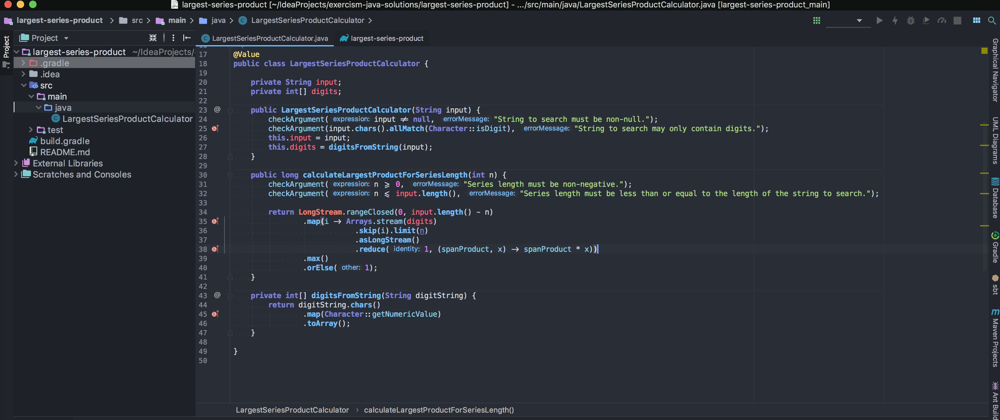
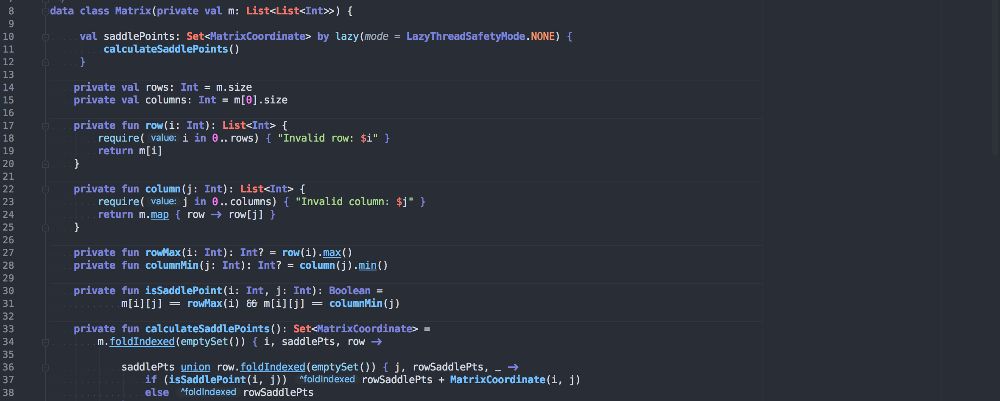
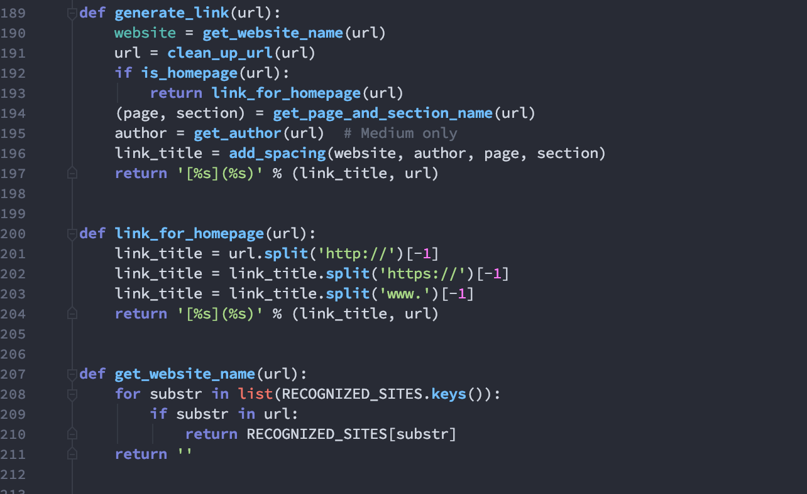

Ziggy Stardust Color Theme
==========================

## Screenshots

Java (IntelliJ):

Kotlin (IntelliJ):

Python (PyCharm):

## Installation  

### JetBrains IDEs  
Copy the *.icls file to the `colors/` subdirectory of where your Preferences are stored:  

See [this link](https://intellij-support.jetbrains.com/hc/en-us/articles/206544519-Directories-used-by-the-IDE-to-store-settings-caches-plugins-and-logs) to find out the location based on the OS & JetBrains product.  

For macOS, this is located at:  
`~/Library/Preferences/{PRODUCT}{VERSION}/colors/`  
e.g.:  
`~/Library/Preferences/IdeaIC2018.2/colors/`  

The Themes work best with [Material Theme UI](http://www.material-theme.com/), and using the Custom UI Theme in `JetBrains/CustomMaterialTheme`. To install these, copy: `material_custom_theme.xml` and `material_theme.xml` to the `/options/` subdirectory of the preferences directory:

e.g.:  
`~/Library/Preferences/IntelliJIdea2018.1/options/` (Ultimate Edition), or   
`~/Library/Preferences/IdeaIC2018.2/options/` (Community Edition), or  
`~/Library/Preferences/PyCharmCE2018.2/options/` (PyCharm CE)  

(see [this link](https://intellij-support.jetbrains.com/hc/en-us/articles/206544519-Directories-used-by-the-IDE-to-store-settings-caches-plugins-and-logs) for exact locations)

### iTerm ###
[Instructions](https://github.com/mbadolato/iTerm2-Color-Schemes#installation-instructions)

**TODO**:

- [x] JetBrains - custom Material Theme
- [x] IntelliJ
- [x] AndroidStudio
- [x] PyCharm
- [ ] WebStorm
- [ ] Atom
- [ ] Sublime - Clean up current
- [x] iTerm
- [ ] Vim
- [ ] Xcode
